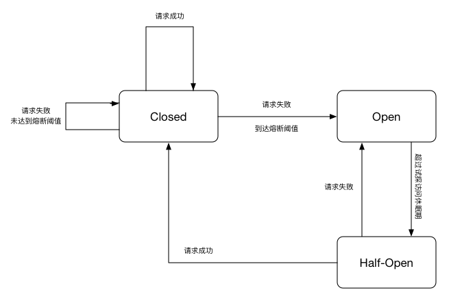

# TmProxy开发文档
TmProxy是手机管车(TM)服务器团队开发的一款轻量级的PHP接口熔断器(之后简称TmP), 该熔断器基础理论基于Netflix团队Hystrix的实现理论, 通过此熔断器可以防止在强依赖接口出现异常时拖垮整个服务.

## TmProxy简介与入门
TmP的核心理论基于Hystrix的滑动时间窗口设计, 通过统计窗口内的请求数以及失败比例判断是否触发熔断器, 熔断器拥有三个状态:

在时间滑动窗口内(10s), 请求总数大于阈值(默认10)且请求成功率低于阈值(默认50%)熔断器会进入打开(open)状态, 打开状态持续一段时间(默认5s)后熔断器会进入半开(half-open)状态, 半开状态下熔断器会放流一些试探请求, 如果请求失败熔断器会继续进入一段时间(默认5s)的熔断期直到下一次半开状态, 如果请求成功, 熔断器会进入关闭(closed)状态, 此时所有请求均会被放流.

注: 时间窗口通过操作时间戳实现, 熔断器为每个接口记录一个10s维度的统计数据组, 超过10s统计组将被清零

## TmProxy测试地址
[暂无]()

## TmProxy的使用说明
TmP有两种使用方式, 一种是使用熔断器提供的三个主要方法markSuccess, markFailure和allowRequest来操作熔断器计数以及获得熔断器状态, 另外, TmP还提供了run方法用于通过回调方式使用熔断器.
### 方法说明

方法名 | 说明 |
--- | --- |
markSuccess | 标记当前请求是成功请求, 无返回值 |
markFailure | 标记当前请求是失败请求, 无返回值 |
allowRequest | 获取当前是否允许放行请求, 返回布尔值true or false |
run | 执行一个function如果出现异常则尝试调用异常回调(fallback)方法, 可能返回布尔值true or false或无返回值 |

注意: 使用run方法时, 如果要采用异常回调函数方式请在实例化TmBreaker类时指定相关回调方法, 否则runFallback方法会认为没有回调方法而采用抛出异常的方式来处理.

### 参数说明
TmP目前有两个类需要使用者声明TmBreakerRedisDriver和TmBreaker, 其中TmBreakerRedisDriver是抽象类TmBreakerDataDriverAbstract的redis实现, 使熔断器能够使用redis作为存储引擎, 而TmBreaker是熔断器的核心类, 提供了所有用户侧方法.

TmBreakerRedisDriver:

方法名 | 说明 |
--- | --- |
$host | redis的地址 |
$port | redis端口号, 默认6379 |
$password | redis连接密码, 默认null |
$timeout | redis连接超时时间, 默认0.04秒 |

TmBreaker:

方法名 | 说明 |
--- | --- |
$key | 所访问接口的服务名, 用于计算存储hashkey |
$dataDriver | 数据驱动实例, 必须是TmBreakerDataDriverAbstract抽象类的实现 |
$config | 熔断器配置, 可覆盖掉默认配置, 默认array() |
$failureFallback | run方法的异常回调方法, 默认null |

## TmProxy的单元测试报告
[单元测试报告](https://htmlpreview.github.io/?https://raw.githubusercontent.com/wolfwang1/tm_proxy/master/assets/index.html)
